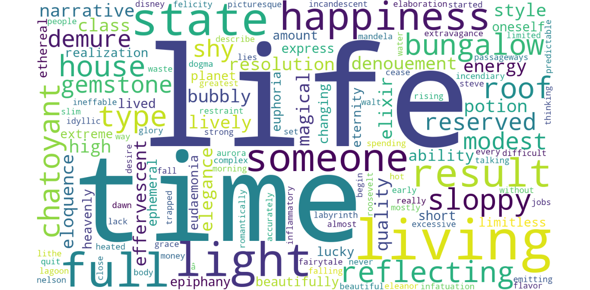

# Word Cloud Generator

This project generates a word cloud from a given text file using Python made by [Halip26](https://halip26.github.io/). The word cloud is a visual representation of the most frequently occurring words in the text.

## Preview



## Features

- Reads a text file and generates a word cloud.
- Displays the word cloud using `matplotlib`.
- Customizable word cloud dimensions and background color.

## Requirements

To run this project, you need the following Python packages installed:

- `wordcloud`
- `matplotlib`

You can install the required packages using the following command:

```bash
pip install -r [requirements.txt](requirements.txt)
```

## File Structure

```bash
├── [main.py](main.py)
├── [requirements.txt](requirements.txt)
├── [words.txt](words.txt)
└── [README.md](README.md)
```

## License

This project is licensed under the [MIT License](LICENSE).
